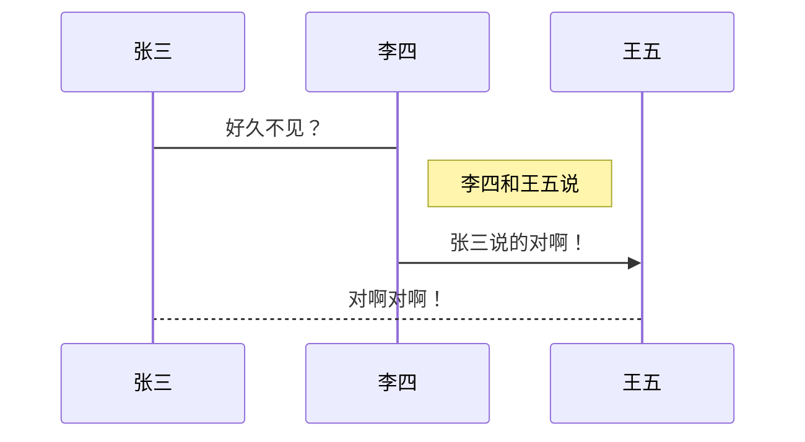

# Markdown学习笔记

作者：沈悟为

摘要：在学习**了不起的markdown**中所记录的一些内容，并加上自己使用markdown中的心得感悟。

## 目录

[toc]

---

## 〇、使用什么来学习

### 0.1	Typora

​	所见即所得的一款免费而好用的编辑器。

[详细使用](#三、更好的使用Typora)


### 0.2	VS Code

​	宇宙最强大的编辑器

[详细使用](#四、更好的使用VS Code)


---


## 一、基础语法

### 1.1	标题的使用

```
# 文档标题

作者

摘要

目录

## 标题1

### 标题1.1

## 标题2

###标题2.2
```

### 1.2	粗体与斜体

**粗体 **  *斜体*

```
**粗体**
*斜体*
```

### 1.3	段落与换行

1. 空一行才是换了段落

2. 如果段内要换行（软回车）需要在上一行的末尾插入两个以上的空格再回车

### 1.4	列表

1. 有序列表

   ```
   数字符号+.+ +内容
   ```

   如果列表有换行，在.之前应该有两个空格

2. 无序列表

   ```
   -+ +内容
   ```

   如果列表有换行，应该有三个空格

3. 嵌套列表

   ```
   第一层
   Tab+第二层
   Tab +Tab +第三层
   ```

4. 注意

   如果列表都只是一行，建议之间别空行

   如果列表有很多行，建议列表之间空一行

   首尾最好都空一行

###	1.5	分割线

```
三个以上的---
```

### 1.6	图片

```
！[无法显示图片的代替文字]（地址）
```

### 1.7	链接

```
标准写法：[链接文字]（链接地址）

引用写法：[链接文字]
[链接文字]:地址

网页链接
<链接地址>
```

如[百度](www.baidu.com)

<http://www.baidu.com>

###	1.8	代码块

```
行内代码用` `

代码块:
​```c++
​```
```

建议：若有输出内容，可以在输入的内容前加上$

### 1.9	引用

```
>+引用的内容
```

> 可以多层引用
>
> > 比如这里有个第二层

----


## 二、GFM语法

### 2.1	删除线

```
~~删除的文字~~
```

如~~删除~~

### 2.2 表情

```
：表情：
```

如:egg:

### 2.3	表格

```
基本样式
| 这是表格的一半    | 这是表格的另一半 |
| ----------------- | ---------------- |
| 这是一个2*2的表格 | 你没有看错       |
```

| 这是表格的一半    | 这是表格的另一半 |
| ----------------- | ---------------- |
| 这是一个2*2的表格 | 你没有看错       |

1. 左对齐   :----
2. 右对齐    ----:
3. 居中对齐   :----:

### 2.4	任务列表

```
- [x] 已完成
- [ ] 还没完成
```

- [x] 已完成

- [ ] 还没完成

### 2.5	锚点

```
[锚点描述]（#锚点名字）
```

[回到目录](#目录)

---


## 三、更好的使用Typora

### 3.1	Typora的拓展语法

#### 3.1.1 下划线

~~~
语法：<u>这段文字有下划线</u>
~~~

样例：<u>这段文字有下划线</u>

快捷键：Ctrl+U

#### 3.1.2 内联数学公式

~~~
$公式$
~~~

比如在这句话内联$\frac{-b\pm \sqrt{b^2-4ac}}{2a}$一个求根公式

#### 3.1.3 上下标

~~~
~下标~
^上标^
~~~

H~2~O与X^2^

#### 3.1.4 高亮

~~~
==light==
~~~

==light==

#### 3.1.5 注释

~~~
<!--我是导出不显示的注释-->
~~~

<!--注释在导出可是不显示的哦-->

#### 3.1.6 脚注

~~~
脚注是这样添加的[^参考]
[^参考]：这是对这段文字的描述
~~~

脚注是这样添加的[^参考]
[^参考]:这是对这段文字的描述

#### 3.1.7 清除样式

使用Ctrl+\可以清除样式

### 3.2	基础的图表功能(基于Mermaid)

**注意**：只支持在Typora中使用

#### 3.2.1 序列图

~~~
```mermaid
mermaid 序列图语法
```

下图源代码
sequenceDiagram
张三->李四:好久不见？
note right of 李四:李四和王五说
李四->>王五:张三说的对啊！
王五-->张三:对啊对啊！
~~~



#### 3.2.2 流程图

~~~
```flow
mermaid流程图语法
```

下图源代码
graph TD
A(开始)-->B[流程1]
B-->C{判断框}
C-->|yes|D(结束)
C-->|No|B
~~~

~~~mermaid
graph TD
A(开始)-->B[流程1]
B-->C{判断框}
C-->|yes|D(结束)
C-->|No|B
~~~

#### 3.2.3 甘特图

~~~
```mermaid
Mermaind甘特图语法
```

下图源码
gantt
dateFormat YYYY-MM-DD
title 项目开发周期
section 需求评审
开始阶段:	 2018-01-01,2018-01-02
section 功能开发
准备阶段:	2020-03-18,2020-05-01
~~~

~~~mermaid
gantt
dateFormat YYYY-MM-DD
title 项目开发周期
section 需求评审
开始阶段:	 2018-01-01,2018-01-02
section 功能开发
准备阶段:	2020-03-18,2020-05-01
~~~


### 3.3	一些实用的功能

#### 3.3.1 查找和替换

快捷键

Ctrl+F：查找面板

F3：下一个

Shift+F3：上一个

Ctrl+H：替换面板

#### 3.3.2 图片管理

1. 可以开启**复制到指定文件夹**便于管理
2. 支持直接右键开启缩放图片

#### 3.3.3 显示模式

F11:全屏

F9：打字机

F8：专注模式

----


## 四、更好的使用VS Code

~~不会吧，不会吧，有程序员不会用vs code吗？~~

### 4.1	插件：MPE

#### 4.1.1 引用文件

~~~
@import "文件名"
~~~

**支持**md，csv，jpg，png，gif，html，pdf

#### 4.1.2 幻灯片

~~~
<!-- slide -->来分页
~~~

**切换主题**

将代码放在文件头部

~~~html
---
presentation:
	theme: solarized.css
---
~~~

### 4.2	更好的编辑

#### 4.2.1 语法检查

使用：markdownlint插件

#### 4.2.2 拼写检查

使用code spell Checker插件

#### 4.2.3 插入图片

“截图”–>“粘贴”

方法1：命令行[paste image]

方法2：Ctrl+Alt+V

#### 4.2.4 禅模式

开启：命令行内搜索禅

关闭：fn+esc

---


## 五、reveal.js(写幻灯片)

### 5.1	准备开始

#### 5.1.1 下载

需要先有git、Node.js。

下载reveal.js

~~~
git clone https://github.com/hakimel/reveal.js.git
~~~

#### 5.1.2 配置环境

1. 安装依赖的模块

   ~~~
   npm install
   ~~~
   
2. 启动web服务

   ~~~
   npm start
   ~~~


### 5.2	初步了解

#### 5.2.1 基本结构

```html
<!doctype html>
<html>
	<head>
		<link rel="stylesheet" href="dist/reveal.css">
		<!-- 这里可以修改幻灯片主题 -->
		<link rel="stylesheet" href="plugin/highlight/monokai.css" id="highlight-theme">
	</head>
    
	<body>
		<div class="reveal">
			<div class="slides">
                <!-- 在section中编写幻灯片的内容 -->
				<section>Slide 1</section>
				<section>Slide 2</section>
			</div>
		</div>

		<script src="plugin/highlight/highlight.js"></script>
		<script>
			//这里修改幻灯片配置
			Reveal.initialize({});
		</script>
	</body>
</html>

```

#### 5.2.2 幻灯片结构

~~~html
<!-- 最外层水平幻灯片-->
<section>
	<section data-markdown>
    	<textarea data-template>
        	## 我是第一页
        </textarea>
    </section>

</section>
~~~

#### 5.2.3 如何使用markdown

1）在HTML中直接使用

~~~html
<section data-markdown>
	<textarea data-template>
    # 我们的内容
    </textarea>
</section>
~~~

2)	HTML文件中调用外部的markdown文件

~~~html
<section data-markdown="外部文件md">
	指定分页规则
</section>
~~~


#### 5.2.4 js的依赖

~~~html
	<script src="dist/reveal.js"></script>
	<script src="plugin/notes/notes.js"></script>
	<script src="plugin/markdown/markdown.js"></script>
	<script src="plugin/highlight/highlight.js"></script>
	<script>
		Reveal.initialize({
			hash: true,
			plugins: [RevealMarkdown, RevealHighlight, RevealNotes]
		});
	</script>
~~~

### 5.3	示范代码

~~~html
<html>

<head>
	<meta charset="utf-8">
	<meta name="viewport" content="width=device-width, initial-scale=1.0, maximum-scale=1.0, user-scalable=no">

	<title>reveal.js</title>
	<link rel="stylesheet" href="dist/reset.css">
	<link rel="stylesheet" href="dist/reveal.css">
	<link rel="stylesheet" href="dist/theme/black.css" id="theme">

	<!-- Theme used for syntax highlighted code -->
	<link rel="stylesheet" href="plugin/highlight/monokai.css" id="highlight-theme">
</head>

<body>
	<div class="reveal">
		<div class="slides">
			<section data-markdown>
				<textarea data-template>
				# 第一次用md写ppt
				作者：沈悟为
				</textarea>
			</section>
			<section data-markdown>
				<textarea data-template>
				本年度的报表
				1. 我们获得了更多的资金
				2. 我们成功上市
				</textarea>
			</section>
		</div>
	</div>

	<script src="dist/reveal.js"></script>
	<script src="plugin/notes/notes.js"></script>
	<script src="plugin/markdown/markdown.js"></script>
	<script src="plugin/highlight/highlight.js"></script>
	<script>
		Reveal.initialize({
			hash: true,
			plugins: [RevealMarkdown, RevealHighlight, RevealNotes]
		});
	</script>
</body>

</html>
~~~

## 附录

### 附录1：排版

1. 空格的使用

	- 英文标点之后需要加空格
	- 使用 > 是两边都要加空格
	- 数字与单位之间不加空格
	- 货币之后不加空格
	
2. 全角与半角
	- 中文全角标点占位比英文半角标点宽

### 附录2：实用工具

1. 记笔记
	- notion（个人正在使用的笔记平台）
	- 印象笔记（据说不错）
	- 有道云笔记（国内大厂）
2. 多人协助
	- Teambition（阿里的，除了网盘还没开放基本可以说是完美
	- 腾讯文档（只要用QQ、微信，应该哪里都能看到吧）
	- 石墨文档
3. 博客
	- gitpgae（免费搭建个人博客平台）
	- CSDN(程序员)
	- 知乎、简书等
4. 微信公众号
	- online-Markdown
	- MD2All
5. 写邮件
	- Markdown Here

6. 交互式文档

	- Jupyter Notebook

7. 写书

	- Gitbook